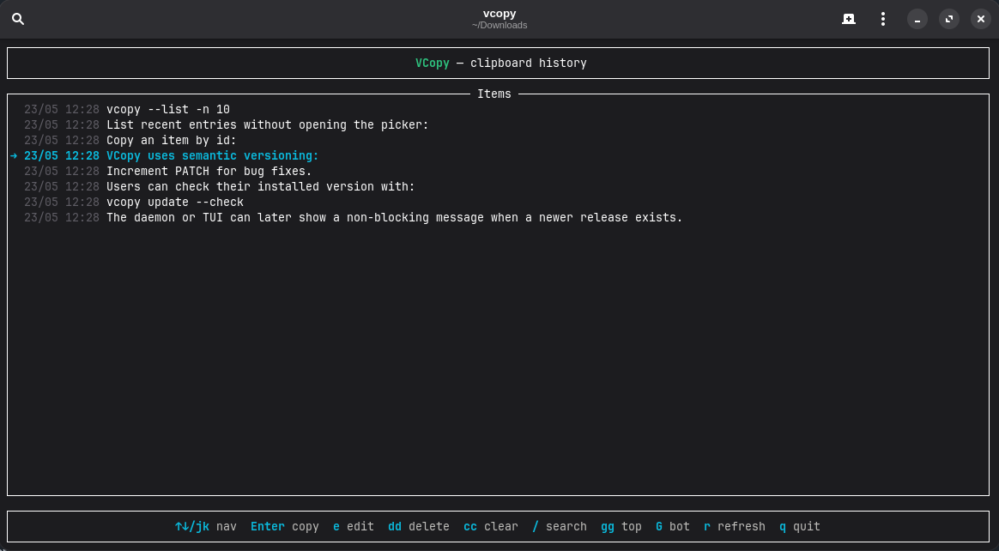

<h1 align="center"><b><font color="#22c55e">VCopy</font></b></h1>

VCopy is a clipboard history tool built for people who live in the terminal but still want a fast popup picker when they need it.



It can run as:

- a background daemon that records clipboard changes
- an interactive terminal UI for quick selection
- a direct CLI for scripting, searching, copying, editing, and deleting history without opening the UI

The command surface is intentionally kept close to the TUI action set, so the same workflow can later be reused by a graphical interface without changing the storage model.

## Supported Terminals

VCopy can generate popup launch commands for:

- GNOME Console (`kgx`, `console`, `gnome-console`)
- Kitty
- Alacritty
- Foot
- WezTerm
- GNOME Terminal
- Konsole
- Xfce Terminal
- Xterm

## Installation

Install the latest Linux release. The installer selects the matching binary for
`x86_64`/`amd64` or ARM64/`aarch64` automatically:

```bash
curl -fsSL https://raw.githubusercontent.com/volneineves/vcopy/main/scripts/install.sh | sh
```

Install a specific version:

```bash
curl -fsSL https://raw.githubusercontent.com/volneineves/vcopy/main/scripts/install.sh | VCOPY_VERSION=v0.1.0 sh
```

The installer places the binary in:

```text
~/.local/bin/vcopy
```

Make sure `~/.local/bin` is in the user's `PATH`.

Release assets use this naming format:

```text
vcopy-linux-x86_64.tar.gz
vcopy-linux-aarch64.tar.gz
```

Build release assets locally:

```bash
rustup target add x86_64-unknown-linux-gnu aarch64-unknown-linux-gnu
scripts/package-release.sh
```

The `rustup target add` command is only needed when using a Rust toolchain
managed by rustup. The script writes release archives to `dist/`. Building the
ARM64 archive from an x86_64 machine may require an ARM64 cross-linker/toolchain;
alternatively, run the script on an ARM64 Linux machine.

## Quick Start

Start the daemon:

```bash
vcopy start
```

Open the terminal picker:

```bash
vcopy
```

List recent entries without opening the picker:

```bash
vcopy --list -n 10
```

Search history:

```bash
vcopy --search meeting
```

Copy an item by id:

```bash
vcopy copy 42
```

## Versioning and Updates

VCopy uses semantic versioning:

```text
MAJOR.MINOR.PATCH
```

- Increment `PATCH` for bug fixes.
- Increment `MINOR` for backwards-compatible features.
- Increment `MAJOR` for breaking CLI, config, storage, or automation changes.

Every release should have a matching Git tag:

```bash
git tag v0.1.0
git push origin v0.1.0
```

Users can check their installed version with:

```bash
vcopy --version
```

Users can update to the latest release with the same installer command:

```bash
curl -fsSL https://raw.githubusercontent.com/volneineves/vcopy/main/scripts/install.sh | sh
```

A future update-check feature can compare `vcopy --version` with the latest GitHub release. A good CLI shape would be:

```bash
vcopy update --check
vcopy update
```

The daemon or TUI can later show a non-blocking message when a newer release exists.

## Interactive UI

```bash
vcopy
```

Opens the terminal history picker.

The TUI action set matches the direct CLI history operations:

- `Enter` / `y`: copy the selected item
- `/`: search history
- `e`: edit a text item
- `dd`: delete the selected item
- `cc`: clear all history
- `r`: refresh the list
- `q`: quit

## Direct History Commands

```bash
vcopy --list
vcopy --list -n 10
vcopy list
vcopy list -l 10
```

Prints history without opening the UI. Each line includes the item id, kind, timestamp, and preview. Use the id with `copy`, `edit`, or `delete`.

```bash
vcopy --search query
vcopy --search query -n 10
vcopy search query
vcopy search query -l 10
```

Searches text previews and image markers without opening the UI. Images are shown as `[image WIDTHxHEIGHT]`.

```bash
vcopy --copy 42
vcopy copy 42
```

Copies a history item by id without opening the UI. Text items are copied as text. Image items are copied back as image data.

```bash
vcopy --edit 42 --content "new text"
vcopy edit 42 "new text"
```

Updates a text item by id without opening the UI. Image items are not edited as text.

```bash
vcopy --delete 42
vcopy delete 42
```

Deletes a single history item by id. If the item is an image, its stored image file is removed too.

```bash
vcopy --clear
vcopy clear
```

Clears all history. Stored image files managed by VCopy are removed as well.

## Daemon Commands

```bash
vcopy daemon
```

Runs the clipboard monitor in the foreground. This is mainly used by service/autostart integrations.

```bash
vcopy start
vcopy stop
vcopy restart
vcopy status
```

Manages the background daemon. The daemon records clipboard text, clipboard images, and new PNG screenshots saved under `~/Pictures/Screenshots`.

## Install Commands

```bash
vcopy install
vcopy uninstall
```

Installs or removes the autostart integration. VCopy prefers a user systemd service when available and falls back to XDG autostart when systemd is unavailable or fails.

## Configuration

```bash
vcopy config
```

Runs the interactive configuration wizard for terminal popup settings, the keyboard shortcut, history limit, and whether history should be cleared when the daemon starts.

The configuration file is stored at:

```text
~/.config/vcopy/config.toml
```

## Language

```bash
vcopy lang
vcopy lang en
vcopy lang pt
vcopy lang es
```

Shows or changes the UI language.

## Clipboard Content Types

VCopy currently supports:

- text clipboard entries
- image clipboard entries
- PNG screenshots saved in `~/Pictures/Screenshots`

Images are intentionally shown as metadata, not previews, so the CLI remains portable across terminals.
